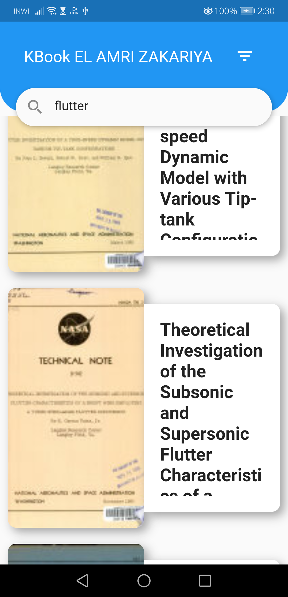
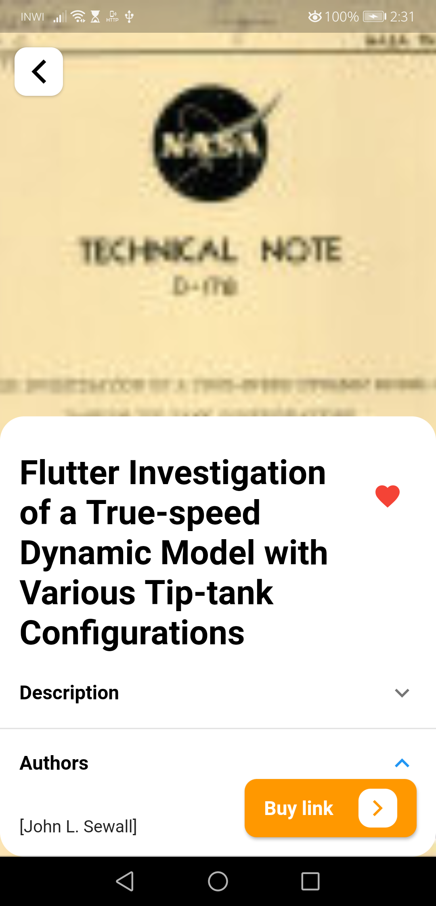

# kbook_elamri_zakariya

TechChallengeKentra-Flutter - EL AMRI ZAKARIYA

# demo

    <table>
        <tr>
            <td> 
                
            </td>    
            <td>   
                
            </td>
             <td>   
                 
            </td>        
        </tr>
        <tr>
            <td> 
                
            </td>    
            <td>   
                
            </td>
            <td>   
                
            </td>            
        </tr>
    </table>

## Getting Started

This project is a starting point for a Flutter application.

A few resources to get you started if this is your first Flutter project:

- [Lab: Write your first Flutter app](https://flutter.dev/docs/get-started/codelab)
- [Cookbook: Useful Flutter samples](https://flutter.dev/docs/cookbook)

For help getting started with Flutter, view our
[online documentation](https://flutter.dev/docs), which offers tutorials,
samples, guidance on mobile development, and a full API reference.
